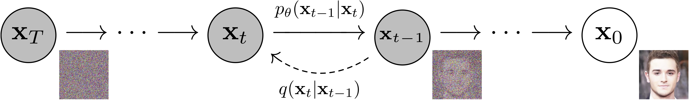
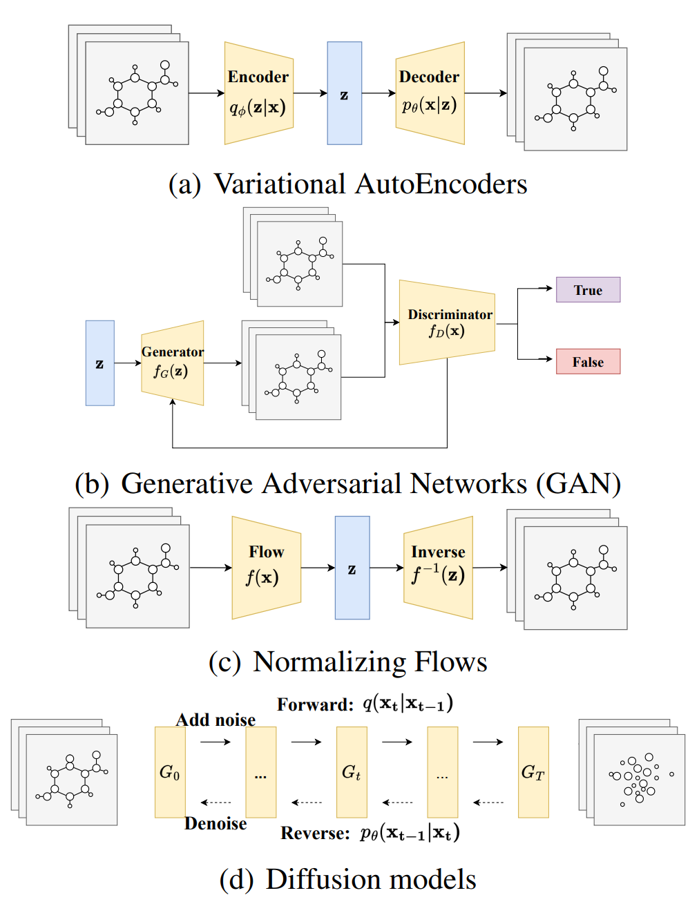

# Diffusion Model

## Term Definitions

- __Markov Chain__ is a type of mathematical model used to describe a sequence of possible events, where the probability of each event depends only on the state of the previous event

- __Variational Inference__ is a method in Bayesian statistics that allows to approximate complex probability distributions by simpler, more manageable ones. The basic idea behind variational inference is to introduce a simpler family of distributions, known as variational distributions, and then to find the member of this family that is closest to the target distribution in terms of the Kullback-Leibler (KL) divergence

- __Kullback-Leibler (KL) divergence__ is a measure of how one probability distribution is different from a second, reference probability distribution

    - Discrete probabilitiy distributions
    $$D_{KL}(P||Q)=\sum_{x \in X} P(x) log(\frac{P(x)}{Q(x)})$$

    - Continious probabilitiy distributions
    $$D_{KL}(P||Q)=\int_{-\infty}^{\infty} P(x) log(\frac{P(x)}{Q(x)}) dx$$

- __Latent variable model__ is a statistical model that incorporates both observed variables and unobserved or hidden variables. The unobserved variables are referred to as "latent" because they cannot be directly measured

- __Gaussian noise__ refers to statistical noise that has a probability density function (PDF) equal to the normal distribution, also known as the Gaussian distribution. The values that the noise can take on are Gaussian-distributed

    - Probability density function
    $$p_G(z)=\frac{1}{\sigma \sqrt{2 \pi}} e^{-\frac{(z-\mu)^2}{2\sigma^2}}$$

    $z$ grey level, $\mu$ mean grey value, $\sigma$ standard deviation 

- __Stochastic Differential Equations (SDEs)__ are a type of differential equation where one or more terms are determined by a stochastic, or random, process. Consequently, the solution to these equations is also a stochastic process

# Denoising Diffusion Probabilistic Models 2020 ([Paper](https://arxiv.org/pdf/2006.11239.pdf))

    

    

## Reverse process

Starting point: $p(x_T)=\mathcal{N}(x_T;0,I)$ 

$$ p_\theta (x_{t-1}|x_t) = \mathcal{N}(x_{t-1};\mu_\theta(x_t,t),\sum _\theta(x_t,t)) $$

$$ p_\theta(x_{0:T}) = p_(x_T) \prod_{t=1}^T p_\theta(x_{t-1}|x_t) $$ 

## Forward process

Fixed to a Markov chain that gradually adds Gaussian noise to the data according to a variance scedule 

$$ q(x_t|x_{t-1}) = \mathcal{N}(x_t; \mu_t = \sqrt{1-\beta_t} x_{t-1}, \sum = \beta_t I) $$

$$ q(x_{1:T}|x_0) = \prod_{t=1}^T q(x_t|x_{t-1}) $$

# Generative Diffusion Models on Graphs: Methods and Applications ([Paper](https://arxiv.org/pdf/2302.02591.pdf))

## Challenges in graph generation

1. __Discreteness:__ graphs are fundamentally discrete structures, which make continuous optimization techniques, such as gradient descent, challenging to apply directly. This can be attributed to the fact that gradients cannot be easily calculated for discrete structures, limiting the effectiveness of back-propagation training in an end-to-end manner
2. __Complex Intrinsic Dependencies:__ graphs have complex dependencies amongst their nodes and edges. This is quite different from other types of data like images where pixels can be considered independent and identically distributed. Nodes in a graph are dependent on each other through the edges that connect them

3. __Permutation Invariance:__ the inherent non-sequential nature of nodes in most graphs, leads to the fact that there exists a possibility of up to N! distinct adjacency matrices, all of which can equivalently represent a singular graph with N nodes

## Problem with current deep generative models (VAE, GAN)

These methods still have limitations, such as VAEs struggling with large-scale graphs, GANs being prone to mode collapse, and flow-based models having difficulty learning graph structures

    

- __VAE:__  generate graphs using probability, necessitating an extensive graph-matching procedure or a precise calculation of the likelihood for each potential node alignment while attaining permutation invariance

- __GAN:__ prone to experiencing mode collapse, which can restrict the size and originality of the generated graphs. Mode collapse occurs when the generator in a GAN starts to produce a limited variety of samples, causing a lack of diversity and novelty in the generated data. This occurrence restricts the model's capacity to generate a diverse and intriguing array of graphs

## Notation

- Graph representation $ G = (X,A) $ consiting of $N$ nodes with $ A \in \mathbb{R}^{N	\times N} $

- $A$ Adjacency matrix where $A_{ij} = 1$ when node $v_i$ and $ v_j $ connected, otherwise $0$

- $X \in \mathbb{R}^{N \times d} $ node features with dimension $d$
- $G_0$ original input graph, $ G_t$ noise graph at time $t$

## Potential in diffusion models

Denoising diffusion models have emerged as a new generative paradigm for enhancing generative capabilities in the image domain. Diffusion models have been successful in various tasks, including image generation and molecular graph modeling

## Paradigms of diffusion models

1. __Score Matching with Langevin Dynamics (SMLD):__ is a diffusion model that adds random noise to a data distribution and then reverses the diffusion process by learning the gradient of the data distribution. It uses a sequence of random Gaussian noises of incremental scales that can be modelled as $q_\sigma (\tilde{x}|x) = \mathcal{N}(\tilde{x}|x,\sigma^{2}I)$

2. __Denoising Diffusion Probabilistic Model (DDPM):__ is a model that uses two parameterized Markov chains to gradually perturb raw data distribution to converge to the standard Gaussian distribution, and then recover the unperturbed data distribution. The forward chain diffuses the data with predefined noise, while the reverse chain trains a parameterized Gaussian transition kernel to reconstruct the desired samples from the noise

3. __Score-based Generative Model (SGM):__ is a method for generating new samples using a diffusion process represented by stochastic differential equations (SDEs). It unifies Score Matching Langevin Dynamics (SMLD) and Denoising Diffusion Probabilistic Models (DDPM) into a continuous version by modeling the diffusion process in continuous time steps with a standard Wiener process

### Pradigms on graphs
1. __SMLD:__ EDP-GNN: This is a score matching-based diffusion method for undirected graph generation. It models symmetric adjacency matrices with different scales of Gaussian noise added to the upper triangular segment using neural networks. It employs a multi-channel GNN layer to obtain node features with a message-passing mechanism and an MLP output layer including a noise-conditioned term
    
    ConfGF: This model adapts SMLD-based diffusion work to molecular confirmation generation. Instead of generating adjacency matrices like EDP-GNN, ConfGF focuses on generating atomic coordinates (node feature) R given the molecular graph G. It maps a set of atomic coordinates to a set of interatomic distances l and learns the score function of interatomic distance distributions

2. __DDPM:__ This category of models focuses on designing appropriate transition kernels of the Markov chain for denoising diffusion probabilistic models on graphs. Examples include Haefeli et al.'s denoising diffusion kernel, DiGress (which extends the DDPM algorithm to generate graphs with categorical node and edge attributes), E(3) Equivariant Diffusion Model (EDMs), Equivariant Energy-Guided SDE (EEGSDE), MDM, and GRAPHARM

3. __SGM:__ These models aim to overcome the limitations of EDP-GNN by using continuous-time SDE systems to model the diffusion process over nodes and edges simultaneously. GDSS is one such model that proposes a continuous-time SDE system and introduces a reverse-time SDE system for nodes and edges. Other models in this category include Graph Spectral Diffusion Model (GSDM), which performs low-rank Gaussian noise insertion, and SGGM, which introduces a latent-based generative framework on the graph

## Summary

Recommend use for generating large graphs is the Score-based Generative Model (SGM).

1. SGM generalizes the diffusion steps into a continuous scenario, making it more flexible and suitable for large graphs. The continuous-time SDE system used in SGM allows for efficient and accurate modeling of the diffusion process

2. GDSS, an implementation of SGM, proposes a continuous-time SDE system to model the diffusion process over nodes and edges simultaneously. This approach can handle both the adjacency matrix and node features, making it well-suited for generating large graphs with complex structures

3. SGM also unifies SMLD and DDPM into a continuous version, allowing you to leverage the benefits of both paradigms while overcoming their limitations

4. SGM implementations like GDSS and GSDM have demonstrated their ability to generate large-scale graphs with high quality

# GDSS: Score-based Generative Modeling of Graphs via the System of Stochastic Differential Equations ([Paper](https://arxiv.org/pdf/2202.02514.pdf)) ([Github](https://github.com/harryjo97/GDSS))

This model enhances the generative process by incorporating a diffusion procedure for graphs, capable of simultaneously generating node characteristics and adjacency through a system of Stochastic Differential Equations (SDEs)

